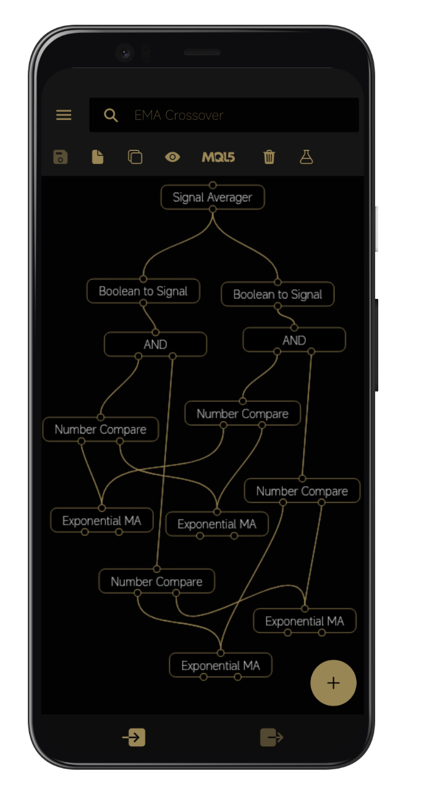
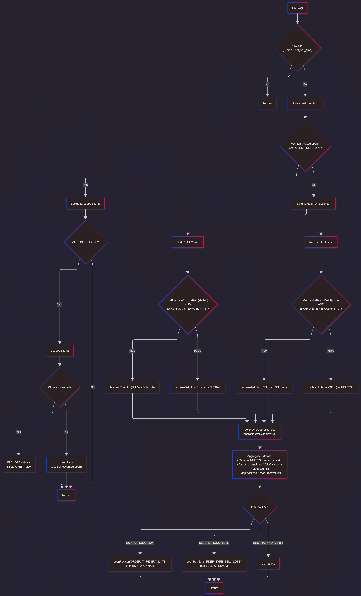
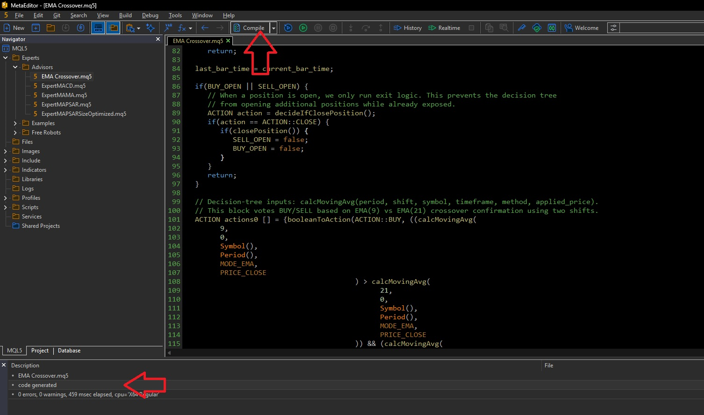
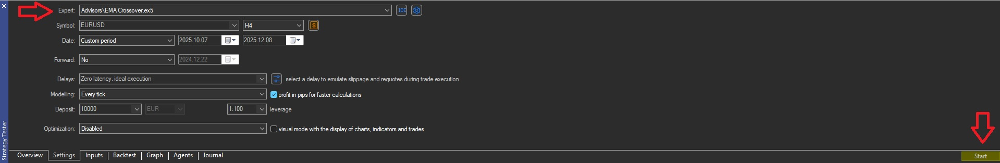
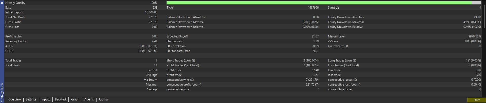
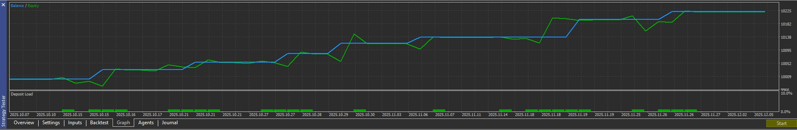

# EMA Crossover (MT5 Expert Advisor)

A **MetaTrader 5 (MT5) Expert Advisor** generated by the **Forex Strategy Studio** Visual Strategy Builder.
It trades an **EMA(9) / EMA(21) Crossover** style signal via a decision-tree/voting block, and manages exits using a configurable SL/TP-style close policy.

> **Risk Disclaimer**
> This project is provided for educational purposes and as a starting point.
> You can use it for live trading, but you do so entirely at your own risk.
> Past performance is not indicative of future results.

## Strategy Summary

- **Entry logic:** EMA(9) vs EMA(21) crossover confirmation using multiple bar shifts.
- **Execution model:** bar-gated (evaluates once per bar to avoid repeated signals on every tick).
- **Position model:** designed around a single open position per symbol tracked by the EA instance.
- **Exit logic:** SL/TP-style local close decision (absolute price, percentage, or pips). A placeholder hook exists for custom close logic.

## Code Structure (How it’s organized)

The code is generated automatically by Forex Strategy Studio, and is organized by responsibility:

- **EA lifecycle / control flow**
  - `OnInit()` — initialization hook (no persistent indicator handles are created here).
  - `OnTick()` — main loop; bar-gates execution, decides whether to manage an open position or evaluate a new entry.

- **Trading operations**
  - `openPosition()` — sends a market deal (BUY/SELL) with the requested lot size.
  - `closePosition()` — closes the currently selected symbol position by sending an opposite-side market deal.

- **Exit policy**
  - `decideIfClosePosition()` — interprets the configured close policy (SL/TP types) and returns whether the EA should close.

- **Decision-tree nodes / utilities**
  - `booleanToAction()` — converts a boolean rule into an `ACTION` vote.
  - `actionAverage()` — aggregates multiple `ACTION` votes into one final `ACTION`.
  - `calcMovingAvg()` — computes a moving average (EMA here) for the requested symbol/timeframe/price.
  - `ActionFromValue()`, `ActionFromDouble()`, `ActionToString()` — mapping helpers.

## Decision Tree: Nodes & Aggregation

This EA uses a simple “decision-tree” style block where individual rules emit **votes** (BUY/SELL/NEUTRAL), then those votes are combined into a final decision.

### What is a “node” here?

In this generated code, a *node* is typically a small function or expression that produces a boolean or numeric result, which is then translated into an `ACTION` vote.

### Voting model

- A rule becomes a vote via `booleanToAction(ACTION::BUY, rule)` or `booleanToAction(ACTION::SELL, rule)`.
- Each vote is one of:
  - `BUY`, `SELL` (or strong variants), or
  - `NEUTRAL` (meaning “no opinion”).
- Votes are combined by `actionAverage(actions, ignoreNeutralSignals=true)`:
  - When `ignoreNeutralSignals` is `true`, `NEUTRAL` votes are treated as **abstain** and do not dilute active signals.
  - The remaining vote scores are averaged and rounded back into a discrete `ACTION`.

### Current nodes used (EMA crossover confirmation)

The `actions0[]` array in `OnTick()` contains two votes:

- **BUY vote:** fast EMA above slow EMA now, and fast EMA below slow EMA a few bars ago (crossover confirmation).
- **SELL vote:** fast EMA below slow EMA now, and fast EMA above slow EMA a few bars ago.

## Inputs / Parameters

### Exposed input parameters

- `LOTS` — trade volume used for new orders.

### Internal exit configuration (in code)

The EA contains internal defaults for exit behavior:

- `closeType` — selects SL/TP policy vs custom close logic placeholder.
- `tpType`, `slType` — NONE / ABSOLUTE / PERCENTAGE / PIPS.
- `tpValue`, `slValue` — the numeric thresholds for the selected type.

If you want to make these configurable from the MT5 UI, you can promote them to `input` variables.

## Install (MetaTrader 5)

1. Open **MetaEditor** → **File → Open Data Folder**.
2. Navigate to:
   `MQL5 → Experts → Advisors`
3. Copy `EMA Crossover.mq5` into that folder.
4. Open the file in MetaEditor and **Compile** it.

## Backtest (Strategy Tester)

1. In MetaTrader 5, open **View → Strategy Tester**.
2. Select the **EMA Crossover** EA, your symbol, timeframe, and date range.
3. Click **Start**.

## Usage Notes / Assumptions / Edge Cases

- **Bar-gating:** the EA intentionally evaluates once per bar, not every tick.
- **State persistence:** internal flags (e.g., whether a BUY/SELL is open) reset when the EA restarts.
- **Hedging vs netting:** position selection/closing behavior depends on account type; the EA is written with “single position per symbol” semantics in mind.
- **Broker execution constraints:** some brokers/symbols may not support `ORDER_FILLING_FOK` (an IOC filling mode may be required).

## Troubleshooting

- **OrderSend fails / retcode not DONE:** check AutoTrading enabled, symbol trading permissions, lot size/step, margin, and broker filling mode.
- **Indicator/CopyBuffer errors:** the terminal may not have enough history loaded yet; wait for data download or scroll chart to load history.