# Forex Strategy Studio - MQL5 Expert Advisors

A curated collection of **MetaTrader 5 (MT5) Expert Advisors** exported from **Forex Strategy Studio**.  
Build your MetaTrader 5 Expert Advisor in the no-code Forex Strategy Studio Strategy Builder, then export them with a click to MQL5 and run them in MetaTrader 5 for live trading or backtesting.

Forex Strategy Studio takes you from <strong>idea</strong> &rarr; <strong>strategy</strong> &rarr; <strong>backtest</strong> &rarr; <strong>execution</strong> without the usual friction.

➡️ Create and refine your strategy logic in the visual strategy builder (no coding required). 
➡️ Validate your approach with powerful on-device backtesting and performance analytics. 
➡️ Iterate quickly, compare results, and only move forward once the data supports the strategy. 
➡️ Then, export your strategy as real <strong>MQL5</strong> source code and run it inside <strong>MetaTrader 5</strong>
as an Expert Advisor.

## How to export Forex Strategy Studio strategies to MetaTrader 5 (MT5)

### 1) In Forex Strategy Studio

1. Open **Forex Strategy Studio**  
   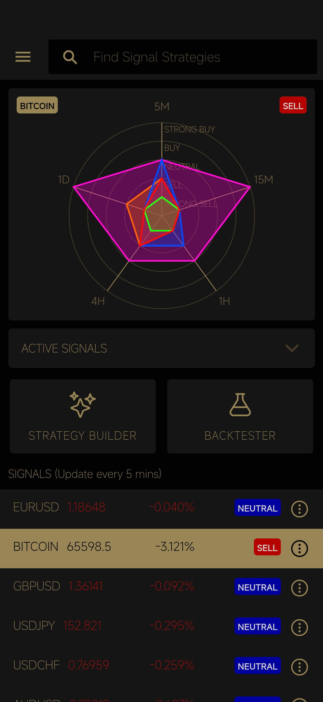

2. Open the **Menu**  
   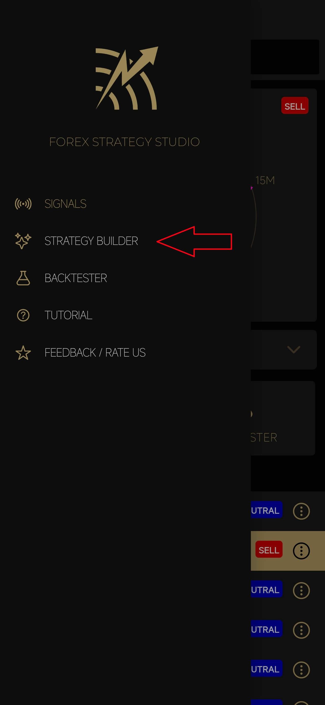

3. Open **Strategy Builder**  
   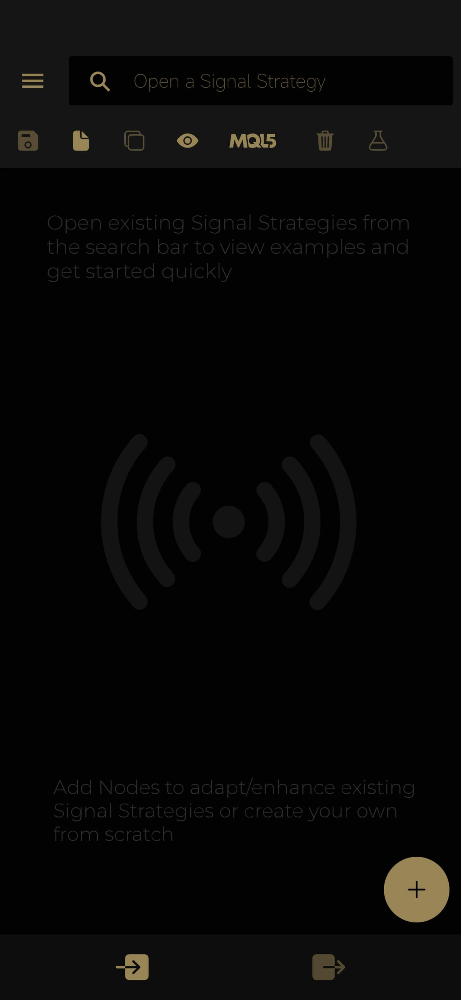

4. Open the strategy selector menu, and open a strategy you want to export to MetaTrader.

   > **Note**
   > The strategy should have **one Signal generator node** (a node which generates a `Signal` output), and **no infinite loops**.

   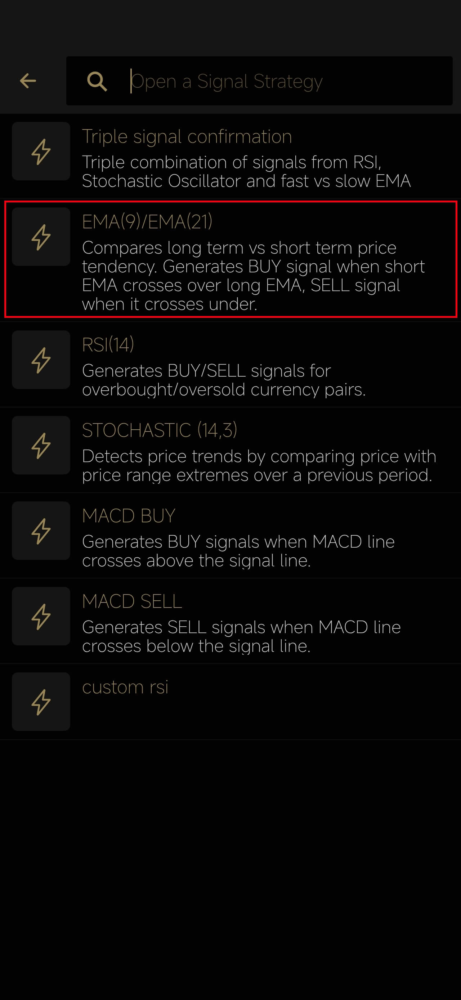
   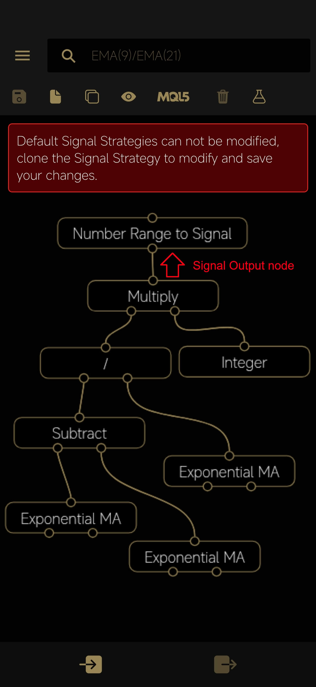

5. Click the **MQL** button and select **Share**  
   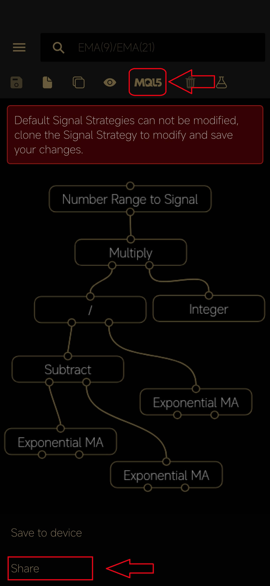

6. Choose a sharing service and upload the file (example: **Google Drive**)  
   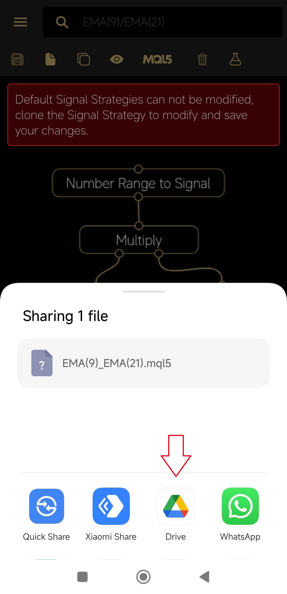
   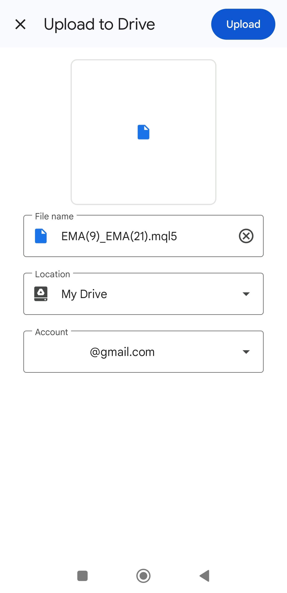

### 2) On your PC

1. Download the **MQL5** file from the sharing service to your PC (example: Google Drive)  
   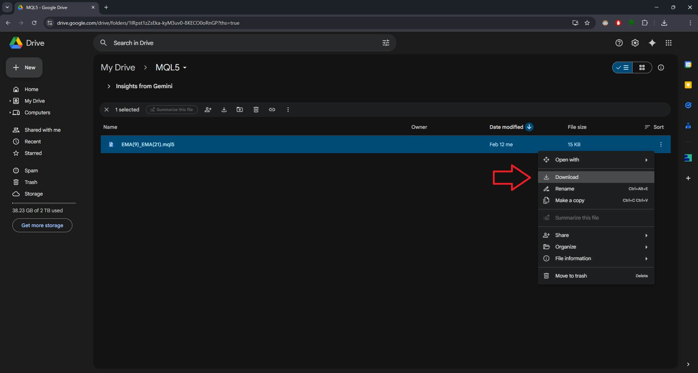

2. Open **MetaEditor** and select **File → Open Data Folder**, then navigate to:
   `MQL5 → Experts → Advisors`  
   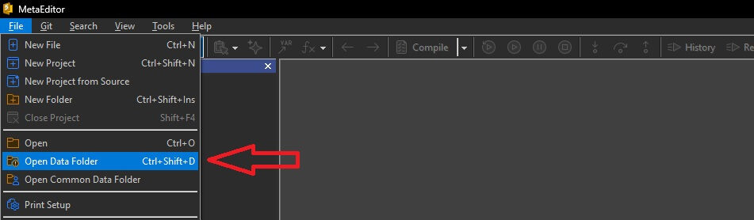

3. Save the file to the **Expert Advisors** folder and change the extension to **.mq5**  
   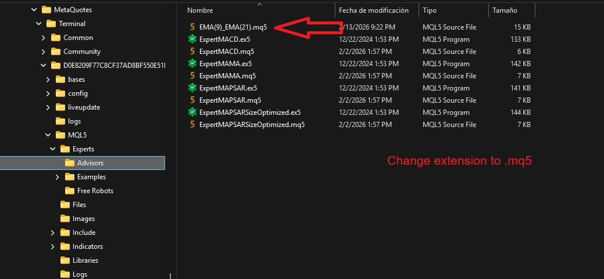

4. Open the saved file in MetaEditor and **Compile** it  
   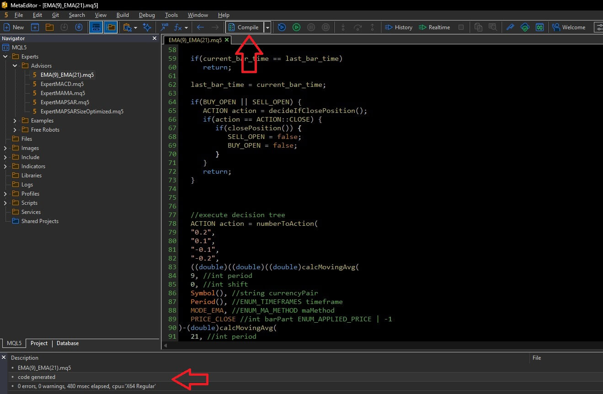

5. Open **MetaTrader 5** and open the **Strategy Tester** (`View → Strategy Tester`)  
   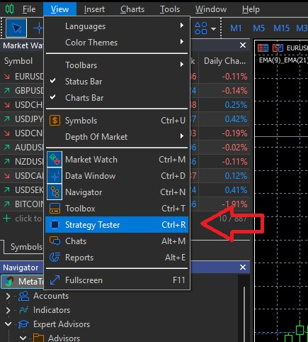

6. Configure the backtest in the Strategy Tester panel: select the Expert Advisor, set the desired parameters (Symbol, Timeframe, Date Range, etc.), and click **Start**  
   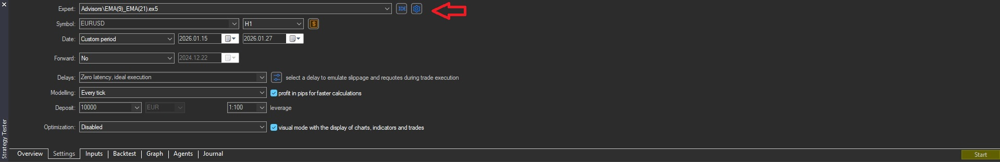

7. After the backtest is complete, analyze results in the various tabs (**Graph**, **Report**, **Journal**, etc.)  
   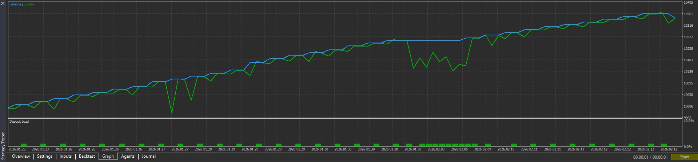
   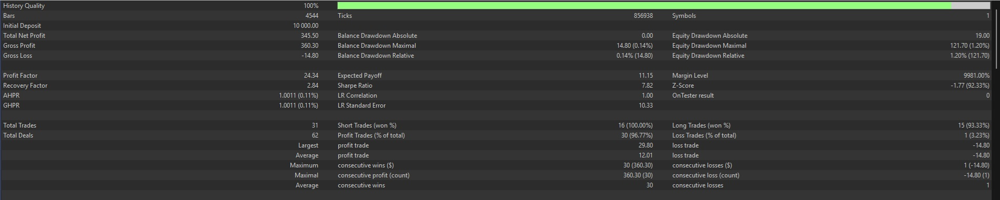
   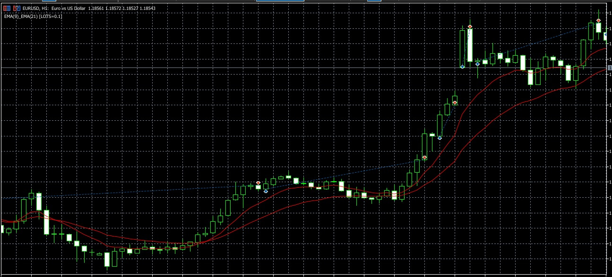